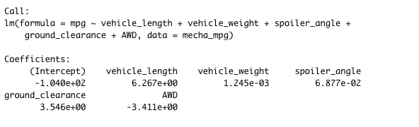
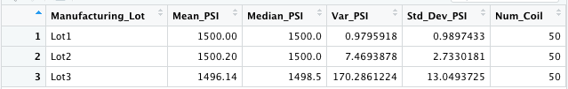
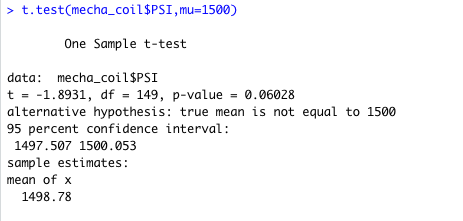
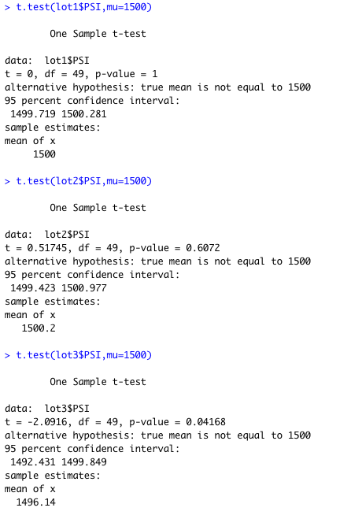

# MechaCar_Statistical_Analysis

## Linear Regression to Predict MPG

  Deliverable 1
  
Resulting Model:
Statistical Summary:

Vehicle length and vehicle ride height provide statistically probable non-random amounts of variation for the model. That said, vehicle length and ground clearance have a appreciable impact on the prototype MechaCar's mileage per gallon. In contrast, vehicle weight, spoiler angle, and all-wheel drive (AWD) all have p-values that do not indicate a relationable variation in the data set.

The 5.35e-11 p-value, shown for this model,  is well below the assumed significance level of 0.05%. This indicates that there is enough evidence to reject our null hypothesis, further suggesting that the slope of this linear model is not zero.

This linear model has an r-squared value of 0.7149, which means that approximately 71% of all mpg predictions are driven by this model. Relatively speaking, their multiple regression model effectively predicts the mpg of MechaCar prototypes.

Withouth the less influential independent variables (vehicle weight, wing angle, and four-wheel drive), the predictability decreases, but not signifficantly: the r-squared value drops from 0.7149 to 0.674.

## Summary Statistics on Suspension Coils
  
  Deliverable 2
  
The Suspension Coil data set provided by MechaCar includes weight capacity test results of multiple coils from different production lots for consistency.

This is the summary of all manufacturing lots:

Ant here are the summary of the three lots

Provided the MechaCar suspension spool design specifications require that the suspension spool variation does not exceed 100 pounds per square inch (PSI).

Looking at the total population of production batches, the spool variance is 62.29 PSI, which is well below the required variance of 100 PSI.

Similarly, but much more consistently, batches 1 and 2 meet the 100 PSI gap requirement; with variances of 0.98 and 7.47, respectively. However, it is lot 3 that shows a much larger gap in performance and consistency, with a gap of 170.29. It is lot 3 that causes a disproportionate variation in the level of the whole.

## T-Tests on Suspension Coils

  Deliverable 3 
The next step is to perform a test t on the coil data to determine if there is a statistical difference between the mean of this given sample dataset and a potential hypothetical population dataset. Using the assumed population average of 1500, we find the following:

t.test_mecha

From this we can see that the true sample mean is 1498.78, which we saw in the statistics summarized above. With a p-value of 0.06, which is above the usual significance level of 0.05, there is NOT enough evidence to support rejection of the null hypothesis. In other words, the average of these three batches of production is statistically equal to the assumed population average of 1,500.

t.test_lots

## Study Design: MechaCar vs Competition
  Deliverable 4
  
  Collected data from comparable models from all major manufacturers over the past 3 years for the following metrics:

Safety Feature Rating: Independent Variable
Current Price (Selling): Dependent Variable
Drive Package : Independent Variable
Engine (Electric, Hybrid, Gasoline / Conventional): Independent Variable
Resale Value: Independent Variable
Average Annual Cost of ownership (Maintenance): Independent Variable
MPG (Gasoline Efficiency): Independent Variable

Hypothesis: zero and alternative

After determining which factors are crucial for the MechaCar genre:

Null Hypothesis (Ho): MechaCar ranks correctly based on performance of key factors of its genre.
Alternative Hypothesis (Ha): MechaCar is NOT ranked correctly based on performance of key factors of its genre.

Statistical tests

Multiple linear regression would be used to determine which factors have the highest correlation/predictability with the current selling price (dependent variable); Which combination has the biggest impact on price (it could be anything!)
